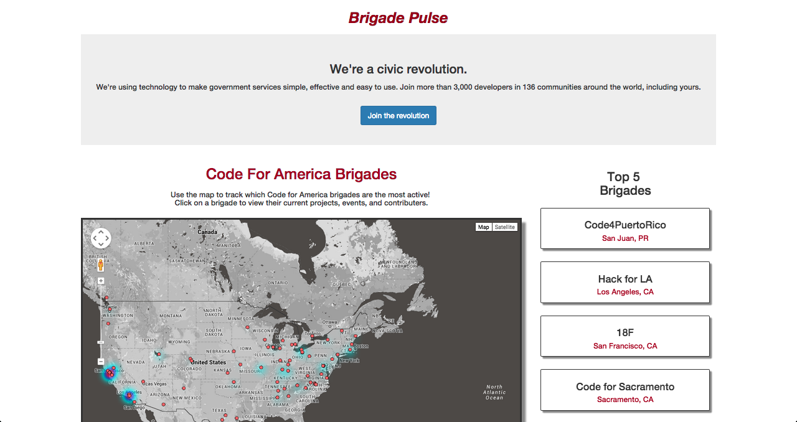

# Brigade Pulse
A [Hack Tennessee 7](http://www.hacktennessee.com/) project graphing Code for America organization participation using the [Code For America API](codeforamerica.org/api). Search for brigades near you, sort them by activity, and quickly find active projects and events.

# Installation
Check out the [Getting Started page](https://github.com/code-for-nashville/brigade-pulse/wiki/Getting-set-up-(backend)) in the wiki.

# Contributing
We welcome all kinds of contributions, including bug fixes, feature implementations, ideas, and help with documentation.  Please search [issues](https://github.com/code-for-nashville/brigade-pulse/issues) and [pull requests](https://github.com/code-for-nashville/brigade-pulse/pulls) before adding something new to avoid duplicating efforts and conversations.

# License
[MIT](http://opensource.org/licenses/MIT)
